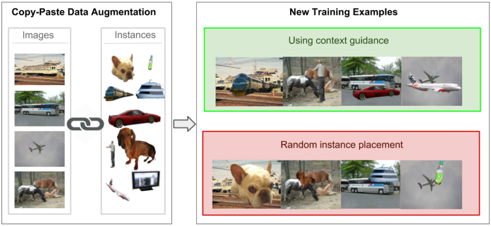

# Modeling Visual Context is Key to Augmenting Object Detection Datasets

 A CNN for explicit context modeling + the pipeline for context-guided data augmentation

## Introduction
This repository contains original code for the paper 'Modeling Visual
Context is Key to Augmenting Object Detection Datasets' by Nikita Dvornik,
Julien Mairal and Cordelia Schmid.
The paper is available at https://arxiv.org/abs/1807.07428.

The project page containing an extension of the proposed method is available at
http://thoth.inrialpes.fr/research/context_aug/.



Here, we start by downloading the PASCAL VOC12 dataset and extracting instances
from it. Then, we show how to train the context model on VOC12train dataset and
apply it to VOC12val-seg subset in order to get suitable for augmentation
location candidates. One may bypass this step and download the locations scored
by us (see below the section "Downloading locations scored by us"). Then, for
each location we find instances that could be placed inside and perform
copy-paste data augmentation on the dataset's images.


The repository borrows the structure of training, inference and data loading
from the [BlitzNet](https://github.com/dvornikita/blitznet) project and some of
the blending routines from the [Cut, Paste and
Learn](https://github.com/debidatta/syndata-generation) repo.

## Citing
Please cite us in your publications if it helps your research:

    @inproceedings{dvornik2018modeling,
      title = {Modeling Visual Contesxt is Key to Augmenting Object Detection Datasets},
      author = {Dvornik, Nikita and Mairal, Julien and Schmid, Cordelia},
      booktitle = {{IEEE Europe Conference on Computer Vision (ECCV)}},
      year = {2018}
    }

## Preparation
1. We assume that the root of the project directory is in the bash variable
    `$ROOT`. To set the variable, enter the root directory and type: 
    ```sh
    ROOT=`pwd`
    ```
    If you wish to change any of the default paths that are going to be created,
    modify `configs/paths.py`.
2. Download VOC2012 dataset by running `$ROOT/scripts/download_datasets.sh`. By
   default, the data will be stored in `$ROOT/Data/`.
3. Next, we need to extract objects from the dataset. To do that, run

    ```sh
    python3 $ROOT/Scripts/extract_instances.py --split=val
    ```
   It will use a subset of VOC12val 
   annotated with instance masks and dump instances to the hard drive. We are
   doing this to perform augmentation on-the-fly later.

4. In case you are going to train you model, download the weights of ResNet50
   pre-trained on ImageNet from
   [here](https://drive.google.com/open?id=1zXn4E4V3IfemEewdx_8RN80frtxRhyWR)
   and unpack the archive to the `$ROOT` folder.

## Training the Context Model
   To train the context model we use only bounding box annotations. Enter the
   following command to train the context model on the VOC12-train subset for
   10K iterations:

    ```sh
    python3 $ROOT/training.py --run_name=voc12train_neg3 --voc=voc12 --split=train --neg_bias=3 --max_iterations=10000
    ```
The flag `--run_name` is required. This gives a unique name to your model. It is to be used later to perform inference and augmentation with this model or to fine-tune the weights if needed.

The flag `--neg_bias=3` means that we will sample 3 times more background context images during the training.

## Context Model Inference
In order to estimate what locations are suitable for pasting new objects
we will run the trained model on each image of the VOC12-val subset that has
instance masks. To do so we are using our trained model and run:

    ```sh
    python3 $ROOT/Scripts/encode_context.py --run_name=voc12train_neg3 --voc=voc12 --split=val --small_data --ckpt=10
    ```
    The flag `--small_data` means that we consider only a subset, annotated with
    instance segmentation masks (here, it's necessary). It will use checkpoint
    from 10K iterations of the specified model.

## Downloading locations scored by us
   In case you don't want to (or can't) train and run your own context model,
   you can download the outputs of a model trained by us from
   [here](https://drive.google.com/open?id=1tnF6vTyAaUZapYXD6dqI8t4ycftolLIX).
   Unpack this archive to `$ROOT` and follow the further instructions below.

## Matching appropriate locations to instances.
   After obtaining highly confident locations for pasting new instances, we need
    to find suitable instances that will fit in each context candidate box. To
    perform matching of context candidates and objects, run:
    ```sh
    python3 $ROOT/Scripts/encode_context.py --run_name=voc12train_neg3 --voc=voc12 --split=val --small_data
    ```
This will retrieve boxes with corresponding scores (scored by voc12train_neg3
model) and match to instances, extracted from voc12val-seg subset. The resulting
mappings will be dumped to the hard drive and later used for augmentation.

## Context-Driven data augmentation
After the above steps are completed, you can experiment with out context-driven
copy-paste data augmentation in `$ROOT/context_aug.ipynb` notebook. Check it out
for more details.
